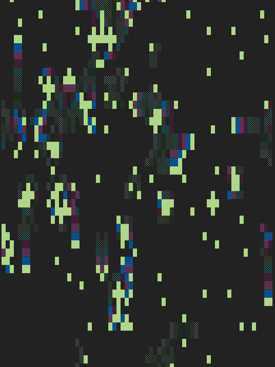
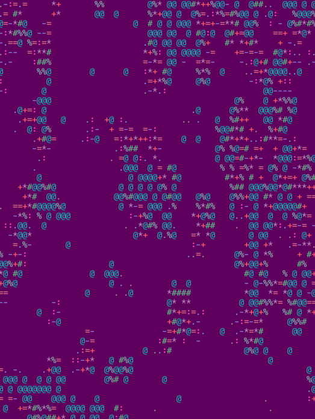
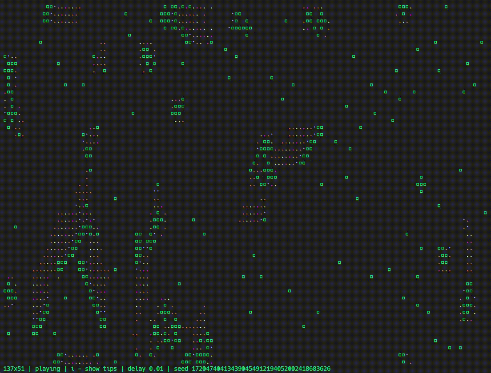

# cela 🧬

<p align="center">
  <strong>✨ A colorful cellular automaton that lives in your terminal ✨</strong>
</p>

<p align="center">
  <a href="https://github.com/cvetyshayasiren/cela">Repository</a>
  ·
  <a href="https://github.com/cvetyshayasiren/cela/issues">Issues</a>
</p>

<p align="center">
  
  <a href="LICENSE"></a>
</p>

<p align="center">
  
  
</p>

`cela` is an interactive terminal simulation of a cellular automaton. 🌈 It renders evolving fields directly in your terminal, supports configurable birth and survival rules, aging cells, custom symbols, reproducible seeds, colors, keyboard controls, and mouse interaction.

## ✨ Features

- 🖥️ Live terminal rendering powered by `curses`
- 📐 Configurable field size and frame delay
- 🧪 Birth/survival rules in `B.../S...[/aging]` notation
- 🎨 Aging cells for more expressive simulations
- 🔤 Random or user-provided symbols
- 🎲 Reproducible runs with a fixed random seed
- 🎮 Runtime controls for pausing, stepping, colors, symbols, and patterns
- 🖱️ Mouse support for drawing directly on the field

## 🎬 Preview

`cela` is designed for a terminal, so it works best in a reasonably large window with color support. 🪟

<p align="center">
  
</p>

## 🧰 Requirements

- 🐍 Python 3.11 or newer
- 🖥️ A terminal with `curses` support
- 🔢 NumPy

Linux and macOS are the primary supported platforms at the moment. 🐧 🍎 Windows may require an additional `curses` implementation such as `windows-curses`. 🪟

## 📦 Installation

The recommended installation method is [`pipx`](https://pipx.pypa.io/). It installs `cela` in an isolated environment and makes the command available globally:

```bash
pipx install git+https://github.com/cvetyshayasiren/cela.git
```

For local development, install the current checkout instead:

```bash
git clone https://github.com/cvetyshayasiren/cela.git
cd cela
pipx install .
```

After installation, start the application with:

```bash
cela
```

## 🚀 Running

Start the simulation with:

```bash
cela
```

Show all command-line options:

```bash
cela --help
```

Examples: 💡

```bash
# Start a fixed-size simulation
cela --width 80 --height 30

# Run Conway's Game of Life
cela --rule B3/S23

# Use a custom symbol palette and a reproducible seed
cela --symbols " .oO" --seed 42

# Start in fullscreen mode with a slower frame rate
cela --fullscreen --delay 0.25

# Stop when the field reaches a stable state
cela --behaviour stop
```

## ⚙️ Command-line options

| 🔧 Option | 📖 Description |
| --- | --- |
| `-W`, `--width` | Field width in cells |
| `-H`, `--height` | Field height in cells |
| `-d`, `--delay` | Delay between frames in seconds |
| `-f`, `--fullscreen` | Use the full terminal window |
| `-r`, `--rule` | Birth/survival rule, for example `B3/S23` |
| `-s`, `--symbols` | Characters used to render cell ages |
| `-S`, `--seed` | Random seed for reproducible runs |
| `-b`, `--behaviour` | What to do when the field stops changing: `pause`, `continue`, or `stop` |

## 🎮 In-app controls

| ⌨️ Key | 🎯 Action |
| --- | --- |
| `q` or `Esc` | Quit |
| `p` | Pause or resume |
| `n` or `Right Arrow` | Advance one generation while paused |
| `Up Arrow` / `Down Arrow` | Increase or decrease the delay |
| `r` | Randomize the field |
| `s` | Randomize the symbols |
| `.` | Randomize cell colors |
| `,` | Randomize the background |
| `/` | Reset colors |
| `1`–`9` | Add a square pattern in the center |
| `b` | Clear the field |
| `i` | Cycle through the hints display |
| Mouse | Click or drag to draw cells |

## 🧬 Rule notation

Rules use the form:

```text
B<birth-neighbor-counts>/S<survival-neighbor-counts>/<aging>
```

For example: 🔍

- `B3/S23` — Conway's Game of Life
- `B2/S0345/10` — a rule with aging enabled up to 10 states

The aging component is optional and defaults to `1`.

## 🛠️ Development

Run the existing test script with:

```bash
python test.py
```

The project keeps the simulation separated into small modules: 🧩

- `cellular_automaton/` — rules and field evolution
- `main/` — argument parsing, rendering, colors, and playback
- `randomisation/` — random symbols and seeds

## 📄 License

Distributed under the Apache License 2.0. See [LICENSE](LICENSE) for the full text. ⚖️

## 🔗 Links

- 🌐 [GitHub repository](https://github.com/cvetyshayasiren/cela)
- 🐛 [Report a bug or request a feature](https://github.com/cvetyshayasiren/cela/issues)
